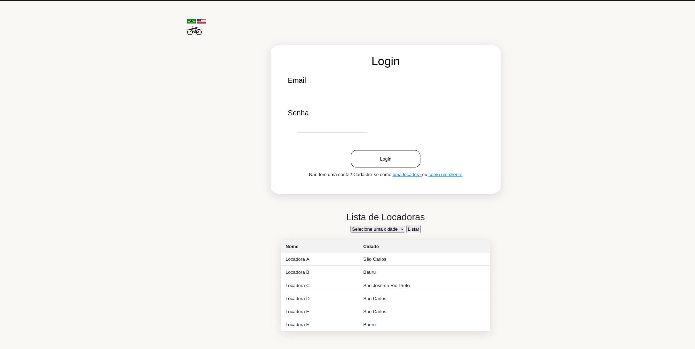
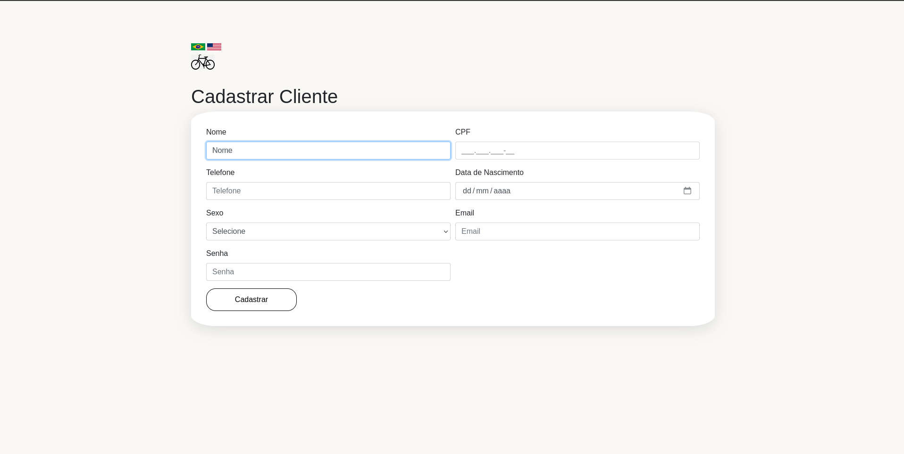
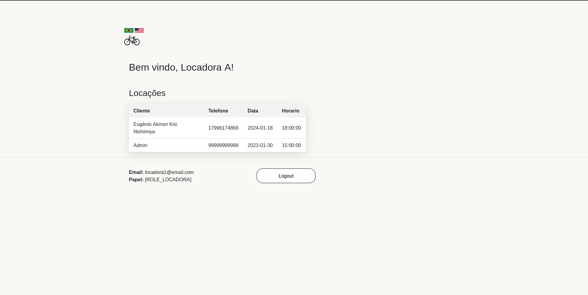
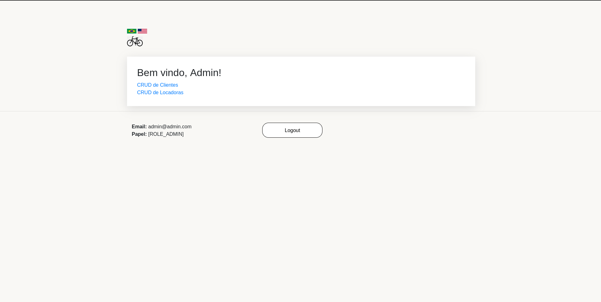
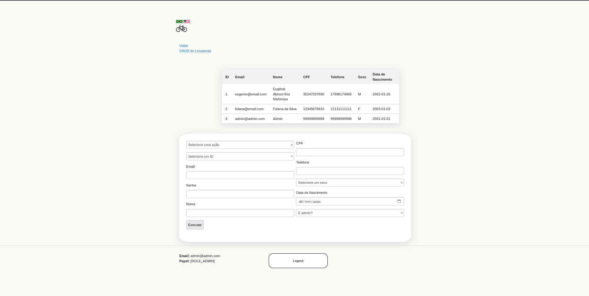
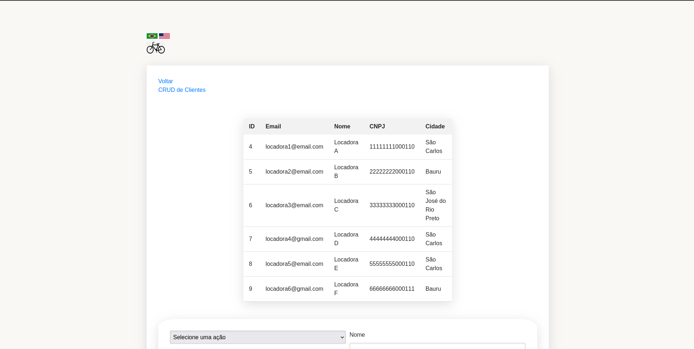
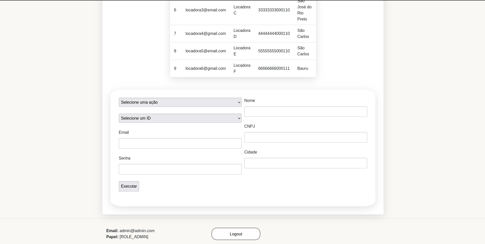

# DSW1-T1
Primeiro trabalho prático da disciplina Desenvolvimento de Software para Web 1 (DSW1) do Departamento de Computação (DC) da Universidade Federal de São Carlos (UFSCar). O objetivo desta atividade foi desenvolver um sistema de locação de bicicletas utilizando das seguintes tecnologias:

## Desenvolvimento
- Apache Tomcat
- Maven

## Frontend
- HTML
- CSS
- Javascript
- JPL

## Banco de Dados
- MySQL

# Banco de Dados
Abaixo encontra-se a abordagem do banco de dados adotada para o projeto.

### Modelo Entidade-Relacionamento 


# Telas
## Página Inicial (index)
A página inicial do sistema possui um formulário de login para um usuário cadastrado e dois links que redirecionam um usuário ainda não cadastrado para a página de cadastro de cliente ou de locadora. Além disso, sem o login, o usuário pode visualizar as locadoras já cadastradas no sistema, podendo filtrar por cidade.



## Cadastro de Cliente
A página de cadastro de cliente possui o formulário que o usuário precisa preencher para acesar o sistema como um cliente.



## Cadastro de Cliente
De maneira análoga, a página de cadastro de locadora possui o formulário que o usuário precisa preencher para acesar o sistema como uma locadora.


## Página Home
Após ser efetuado o login, o usuário é redirecionado para uma página home personalizada de acordo com o seu papel cadastrado.
### Home do Cliente
Aqui, o cliente pode visualizar suas locações cadastradas.

### Home da Locadora
Aqui, a locadora pode visualizar os clientes que contrataram seu serviço.

### Home do Administrador
O administrador pode acessar as páginas de CRUD (Create, Read, Update, Delete) de clientes e de locadoras.


## CRUD
### Crud Clientes

### Crud Locadoras



# Internacionalização do Sistema
O sistema é internacionalizado em dois idiomas: Inglês e Português. A linguagem é automaticamente detectada pelo navegador, isto é, se o idioma do navegador for português, o sistema estará escrito em português, o mesmo para o inglês.

# Execução do projeto
Parar rodar a aplicação, basta clonar o repositório
```
$ git clone https://github.com/compermane/T1-DSW1
```
Entrar na pasta do T1
```
$ cd T1
```
E executar o maven
```
$ mvn clean compile package
```

Isso gerará um arquivo .war do projeto. No localhost do Tomcat, fazer o deploy desse arquivo e acessar o link relacionado.

## Troubleshooting
Pode ser que haja problemas com o Java. No terminal, basta digitar
```
$ export JAVA_HOME=/usr/lib/jvm/jdk-21-oracle-x64
```
Além disso, se faz necessário a inicialização do 

## Desenvolvido por
- Eugênio Akinori Kisi Nishimiya, github: [github.com/compermane](https://github.com/compermane)
