# DSW1-T2
Segundo trabalho prático da disciplina Desenvolvimento de Software para Web 1 (DSW1) do Departamento de Computação (DC) da Universidade Federal de São Carlos (UFSCar). O objetivo desta atividade foi desenvolver um sistema de locação de bicicletas utilizando das seguintes tecnologias:

## Desenvolvimento
- Apache Tomcat
- Maven

## Backend
- Spring MVC
- Spring Data JPA
- Spring Security
- Thymeleaf

## Frontend
- HTML
- CSS
- Javascript
- Bootstrap

## Banco de Dados
- MySQL

# Banco de Dados
Abaixo encontra-se a abordagem do banco de dados adotada para o projeto.

### Modelo Entidade-Relacionamento 
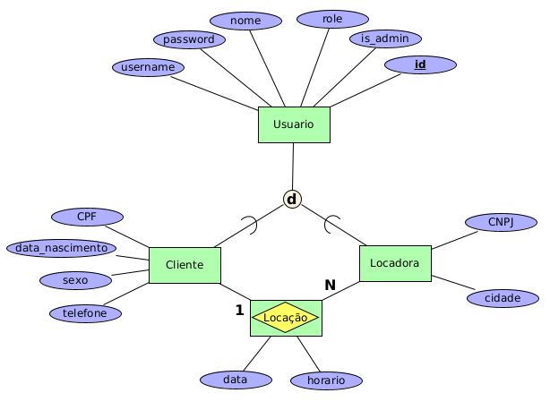

### Tabelas SQL
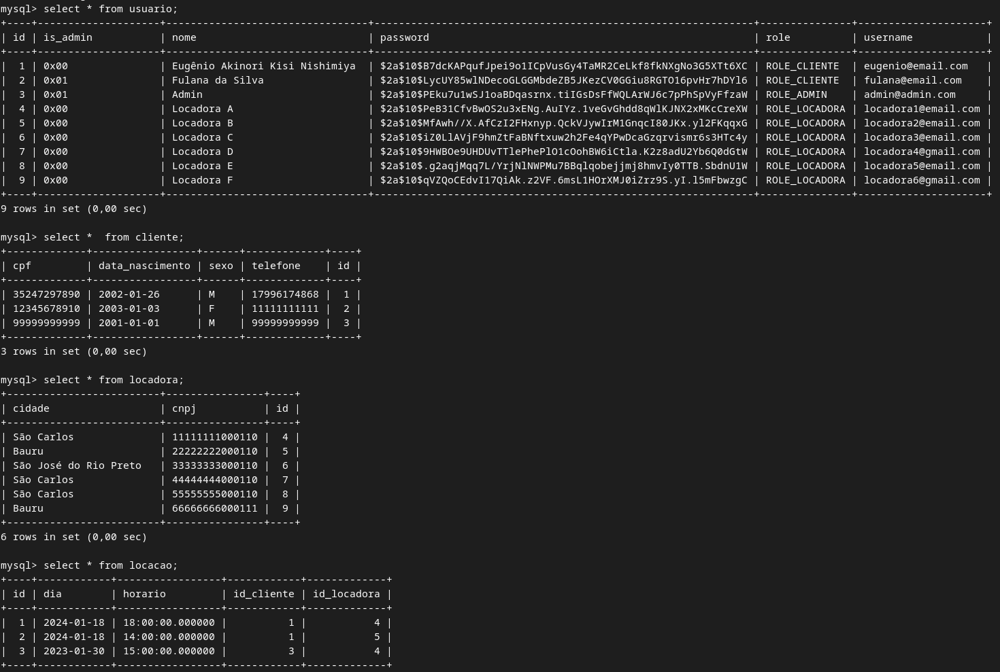

# Telas
## Página Inicial (index)
A página inicial do sistema possui um formulário de login para um usuário cadastrado e dois links que redirecionam um usuário ainda não cadastrado para a página de cadastro de cliente ou de locadora. Além disso, sem o login, o usuário pode visualizar as locadoras já cadastradas no sistema, podendo filtrar por cidade.

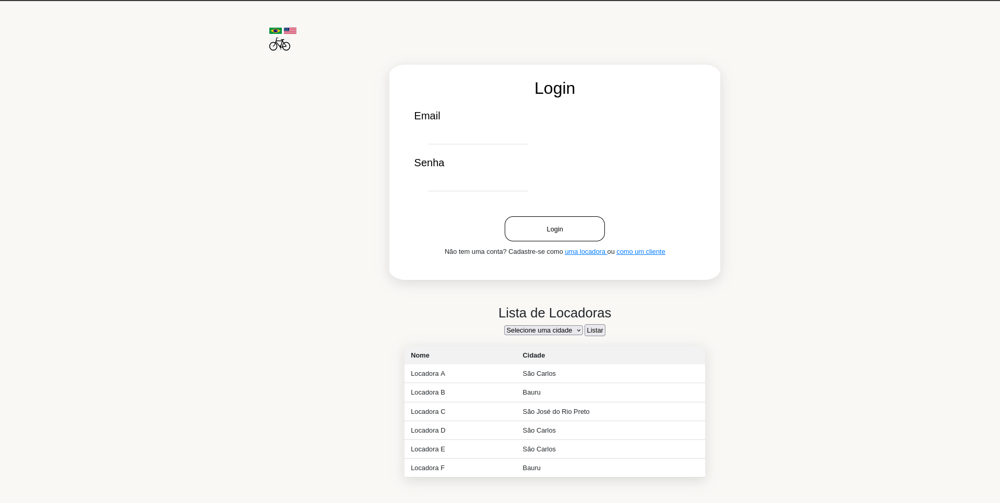

## Cadastro de Cliente
A página de cadastro de cliente possui o formulário que o usuário precisa preencher para acesar o sistema como um cliente.

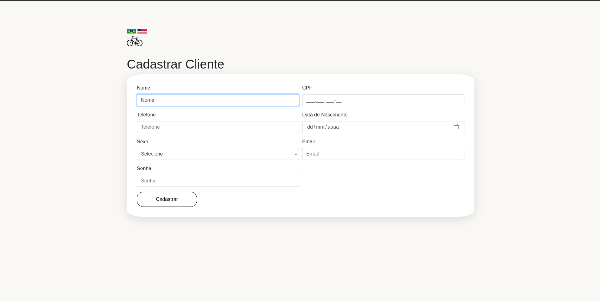

## Cadastro de Cliente
De maneira análoga, a página de cadastro de locadora possui o formulário que o usuário precisa preencher para acesar o sistema como uma locadora.


## Página Home
Após ser efetuado o login, o usuário é redirecionado para uma página home personalizada de acordo com o seu papel cadastrado.
### Home do Cliente
Aqui, o cliente pode visualizar suas locações cadastradas.
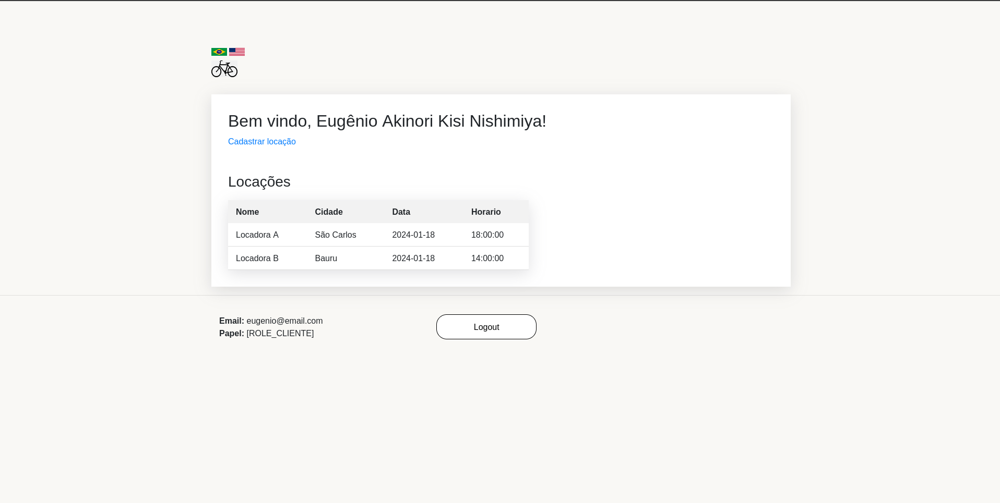
### Home da Locadora
Aqui, a locadora pode visualizar os clientes que contrataram seu serviço.
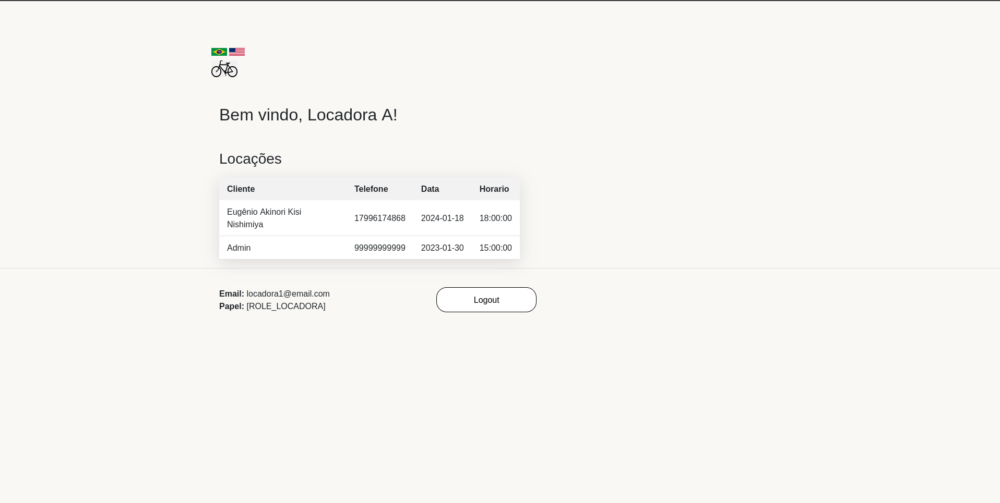
### Home do Administrador
O administrador pode acessar as páginas de CRUD (Create, Read, Update, Delete) de clientes e de locadoras.
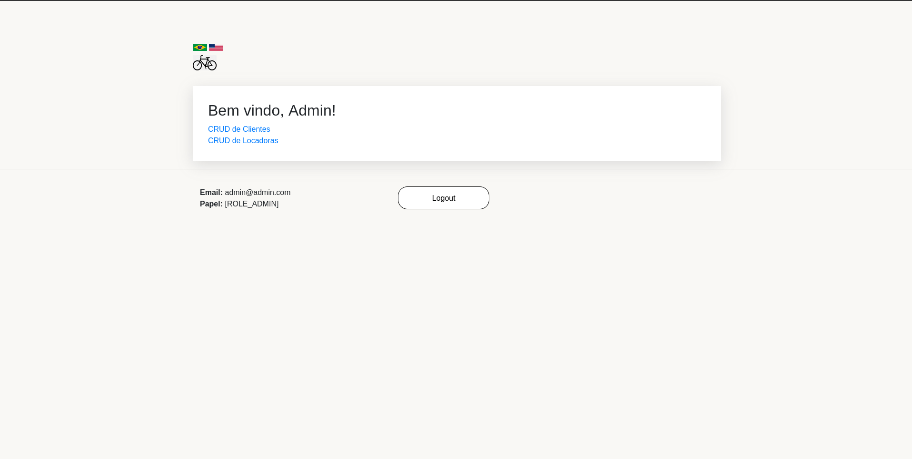

## CRUD
### Crud Clientes
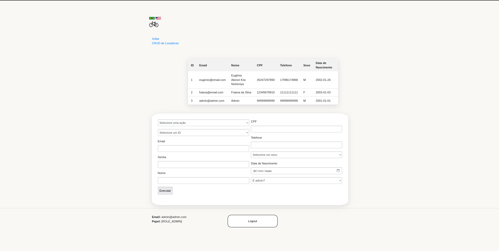
### Crud Locadoras
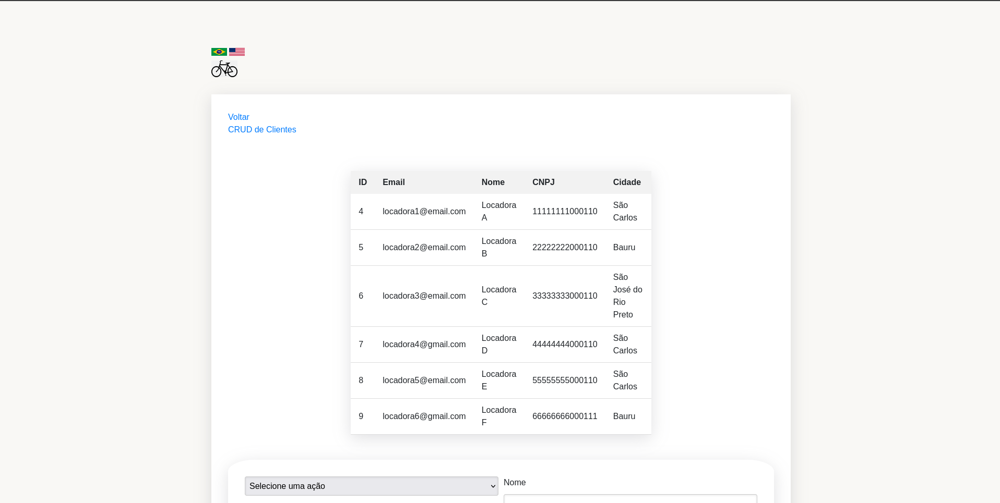
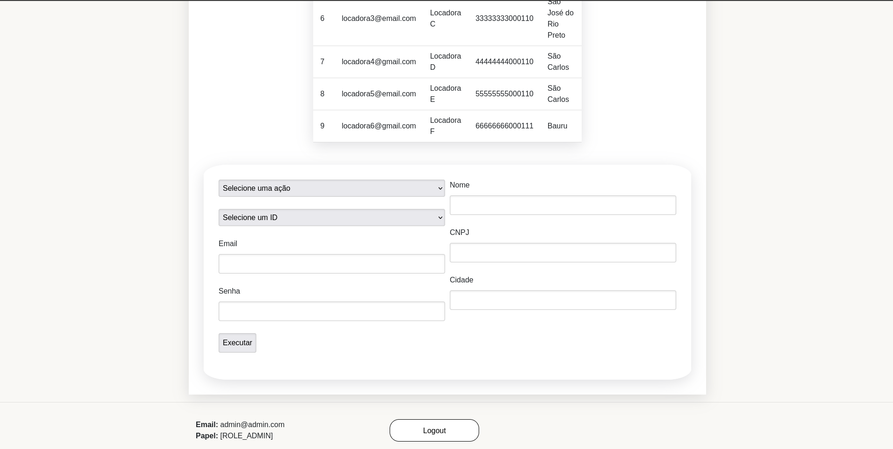

# Internacionalização do Sistema
O sistema é internacionalizado em dois idiomas: Inglês e Português. A atualização do idioma é realizado clicando nas bandeiras que aparecem no "header" das páginas. Isso foi feito utilizando Thymeleaf na codificação do HTML e dois aquivos, um para cada idioma especificando cada texto de cada página. Abaixo, um exemplo da tela inicial, agora em inglês.
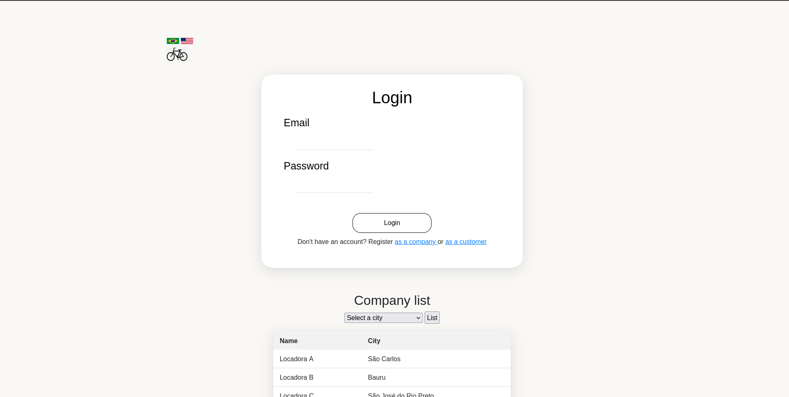

# Execução do projeto
Parar rodar a aplicação, basta clonar o repositório
```
$ git clone https://github.com/compermane/T1-DSW1
```
Entrar na pasta do T2
```
$ cd T2_DSW1
```
E executar o maven
```
$ mvn spring-boot:run
```
## Troubleshooting
Pode ser que haja problemas com o Java. No terminal, basta digitar
```
$ export JAVA_HOME=/usr/lib/jvm/jdk-21-oracle-x64
```

## Desenvolvido por
- Eugênio Akinori Kisi Nishimiya, github: [github.com/compermane](https://github.com/compermane)
