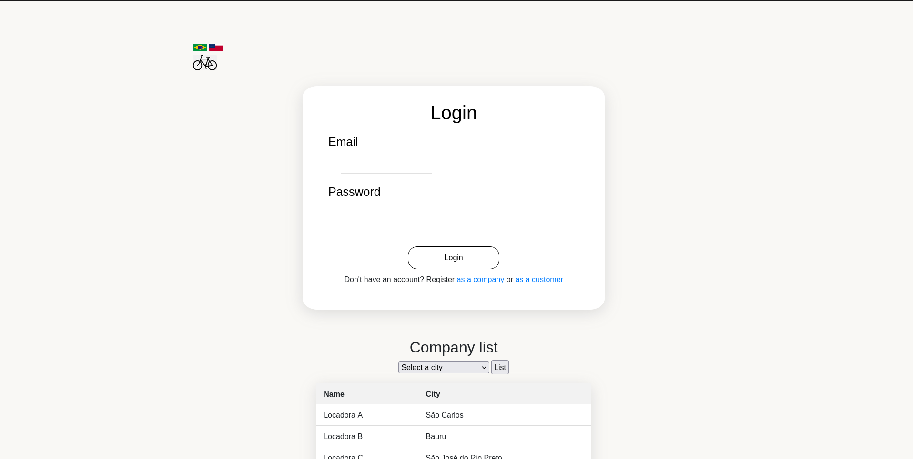

# DSW1-T3
Terceiro trabalho prático da disciplina Desenvolvimento de Software para Web 1 (DSW1) do Departamento de Computação (DC) da Universidade Federal de São Carlos (UFSCar). O objetivo desta atividade foi desenvolver uma API REST para um sistema de locação de bicicletas utilizando das seguintes tecnologias:

## Desenvolvimento
- Apache Tomcat
- Maven

## Backend
- Spring MVC
- Spring Data JPA
- Spring Security
- Thymeleaf

## Frontend
- HTML
- CSS
- Javascript
- Bootstrap

## Banco de Dados
- MySQL

# Banco de Dados
Abaixo encontra-se a abordagem do banco de dados adotada para o projeto.

### Modelo Entidade-Relacionamento 


### Tabelas SQL


## Rotas da API
### Clientes


### Locadoras


### Locações


# Internacionalização do Sistema
O sistema é internacionalizado em dois idiomas: Inglês e Português. A atualização do idioma é realizado clicando nas bandeiras que aparecem no "header" das páginas. Isso foi feito utilizando Thymeleaf na codificação do HTML e dois aquivos, um para cada idioma especificando cada texto de cada página. Abaixo, um exemplo da tela inicial, agora em inglês.


# Execução do projeto
Parar rodar a aplicação, basta clonar o repositório
```
$ git clone https://github.com/compermane/T1-DSW1
```
Entrar na pasta do T2
```
$ cd T2_DSW1
```
E executar o maven
```
$ mvn spring-boot:run
```
## Troubleshooting
Pode ser que haja problemas com o Java. No terminal, basta digitar
```
$ export JAVA_HOME=/usr/lib/jvm/jdk-21-oracle-x64
```

## Desenvolvido por
- Eugênio Akinori Kisi Nishimiya, github: [github.com/compermane](https://github.com/compermane)
